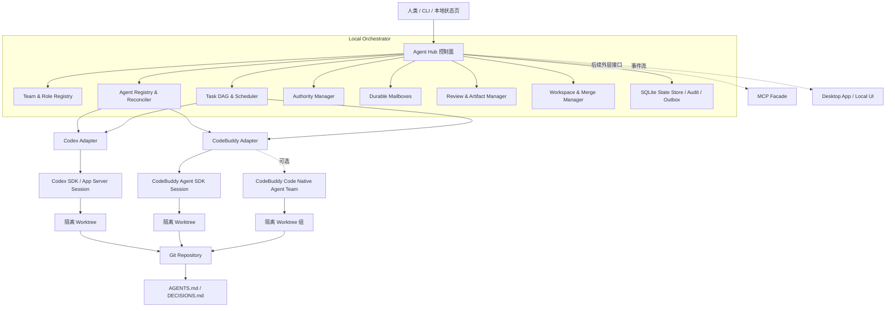
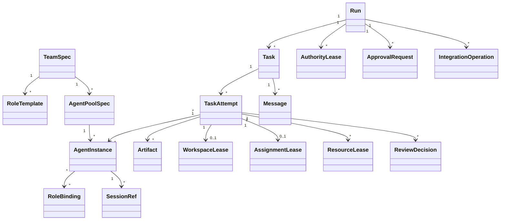
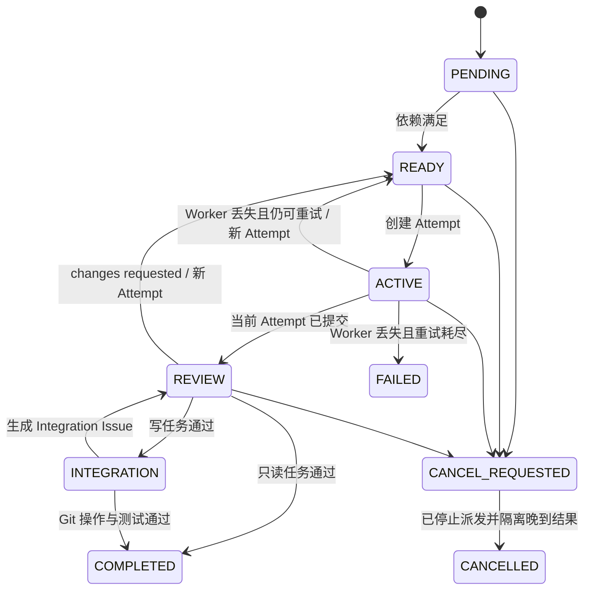
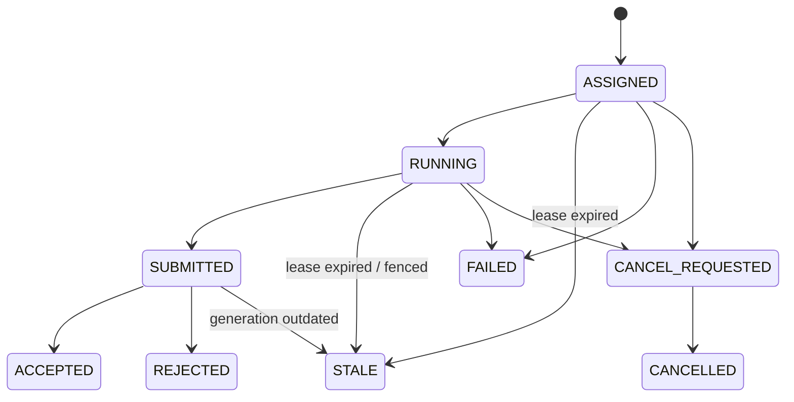

# Cross-Harness Agent Team Orchestrator 实施计划

> 文档状态：Draft v1.0  
> 编制日期：2026-08-30  
> 项目目录：`D:\workspace\connect`  
> 目标执行端：Codex；CodeBuddy Code CLI / Agent SDK  
> 候选人类界面：WorkBuddy 桌面端（兼容性需在阶段 0 实测）  
> 依据：引用对话“分析可行性”的最新结论，并按当前官方文档校正

## 0. 结论先行

项目可行，推荐将它正式定义为：

> 一个本地优先的跨 Harness 多 Agent 团队编排系统。它把 Codex、CodeBuddy Code 等执行端统一抽象为 Agent Backend，通过可配置的职位、人数、权限和上下级关系，完成任务拆解、并行委派、Agent 间通信、审核返工、安全集成和主管移交。

实施时采用“Agent Hub + Backend Adapter”架构，不依赖两个已经打开的桌面聊天窗口互相注入消息。自动协作发生在底层 Agent Session 之间，桌面 App 只作为人类观察、审批和干预界面。

首版不直接照搬 MetaGPT、AG2 或 CrewAI，也不把 CodeBuddy Code 原生 Agent Teams 当作唯一底座。建议：

- 借鉴 MetaGPT 的 Team / Role 抽象。
- 借鉴 AG2 的 Hub、注册表、消息与审计思路。
- 借鉴 CrewAI 的 Manager → Worker → Validation 闭环。
- 借鉴 OpenAI Agents SDK 的 agents-as-tools 与 handoffs 编排模式；本文的 System Supervisor Handoff 是自建的项目级权限协议，不等同于 SDK Handoff。
- 使用 Codex SDK 与 CodeBuddy Agent SDK 作为主要程序化执行入口。
- 将 MCP 作为后续外部接口，而不是调度核心。

以一名熟悉 Python、Git 和 Windows 的开发者估算：

| 阶段 | 参考周期 | 结果 |
|---|---:|---|
| 可行性闸门 | 2–4 天 | 验证双 SDK、并发 Session、权限与恢复 |
| PoC | 5–8 天 | 跑通主管 → 双 Worker → 审核 → 返工 → 集成 |
| MVP | 3–4 周 | 形成可配置、可恢复、可审计的本地工具 |
| Beta | 3–5 周 | 完成压力、安全、升级回滚与兼容性验证 |

以上周期不包含账号开通、厂商接口变化或并发额度申请造成的等待。

## 1. 已冻结的关键决策

| 编号 | 决策 | 含义 |
|---|---|---|
| D-01 | 自动协作发生在底层 Session | 不依赖 GUI 点击、剪贴板轮询或向已有桌面会话强行 push |
| D-02 | Hub 是跨系统控制面 | 团队、任务、消息、权限和审计不寄存在某一个 Harness 内 |
| D-03 | Role Template 与 Agent Instance 分离 | 同一职位可有多个 Agent；同一 Agent 可在任务边界切换职位 |
| D-04 | Agent 数量由配置决定 | `count` 可调整，代码不写死 2 个或 3 个 Agent |
| D-05 | 系统主管与原生 Team Lead 分离 | `System Supervisor ≠ CodeBuddy Code Native Team Lead` |
| D-06 | SDK-first，MCP-later | SDK 负责启动和维持 Session；MCP 后续提供外部调用入口 |
| D-07 | 写任务默认使用独立 worktree | 不允许多个 Agent 在用户当前 checkout 中并发改文件 |
| D-08 | 根目录 `AGENTS.md` 是共同基础规则源 | 首版禁止未登记的嵌套 `AGENTS.md`、`AGENTS.override.md` 和会遮蔽它的 `CODEBUDDY.md` |
| D-09 | SQLite 是运行时唯一事实源 | `TASKS.md`、`HANDOFF.md` 只做自动生成的只读视图 |
| D-10 | Git commit 是代码交付载体 | Worker 提交 commit、测试和证据，不交付散落的未提交修改 |
| D-11 | 主管移交只在安全检查点发生 | Handoff 是原子权限变更，不是一句自然语言消息 |
| D-12 | CodeBuddy Code Agent Teams 是实验性可选模式 | 首版可用多个独立 SDK Session 实现并行 |

## 2. 当前可行性与前置条件

### 2.1 已确认的能力

- Codex 官方 SDK 可以程序化启动、继续和恢复本地 Codex thread；当前官方文档同时提供 Python 与 TypeScript SDK，其中 Python SDK 文档明确提供 stable 版本。Codex App Server 还提供会话历史、审批和流式事件，但官方目前将 `codex app-server` 命令及 WebSocket transport 标记为 Experimental，因此只进入后续适配原型。
- Codex 官方支持 Subagents 与 Git worktrees；官方同样提醒，并行更适合独立、读多写少的工作，多个 Agent 并发写入会增加冲突和协调成本。
- CodeBuddy Agent SDK 支持 Python 与 TypeScript、指定工作目录、Session 管理、工具权限、Hooks 和自定义 Agent，但当前仍标记为 Preview。
- CodeBuddy SDK 默认不读取项目配置；必须显式启用 project setting source，才能加载项目记忆、规则、MCP 和相关配置。
- CodeBuddy Code Agent Teams 当前标记为 Experimental，已具备独立上下文、共享任务列表、成员消息和自主认领；同时存在固定 Team Lead、不能嵌套 Team、无法恢复成员、任务状态延迟和同文件覆盖等已知限制。
- CodeBuddy 在项目没有 `CODEBUDDY.md` 时可读取 `AGENTS.md`。

注意：上述 SDK、Sub-agents、Agent Teams 和 Worktree 文档描述的是 CodeBuddy Code CLI / SDK。WorkBuddy 桌面产品是否完整暴露这些行为，需要在目标安装版本上实测。跨产品 Bridge 仍是自建能力，不能视为厂商已提供的现成功能；MVP 的直接控制界面是 CLI / 本地状态页，桌面端能否直接观察同一 SDK Session 也属于阶段 0 验证项。

### 2.2 当前工作区状态

编制本文档时：

- 除本计划文档外，`D:\workspace\connect` 尚无项目骨架。
- 当前目录不是 Git 仓库。

因此进入 PoC 前必须先创建最小项目骨架并初始化 Git。本文档不授权自动覆盖或处理未来已有的未提交改动。

### 2.3 Go / No-Go 闸门

只有满足以下条件才进入 PoC：

1. Codex 和 CodeBuddy Code 各有一种受支持的非 GUI 程序化入口。
2. 可以启动至少两个上下文和 Session 标识相互隔离的 CodeBuddy Agent。
3. 两端均能区分成功、失败、超时与取消。
4. 可以指定工作目录，并把文件访问限制在允许根目录内。
5. 可以恢复 Session，或明确、安全地创建替代 Session。
6. 敏感凭据无需进入 YAML、Prompt、Git 或日志。
7. 已确认账号许可、并发限制、速率限制和费用边界。

如果第 1–4 项任一不成立，停止自动桥接，回退到：

> `AGENTS.md + Git worktree + 人工 TASKS/HANDOFF + 人工审核`

## 3. 目标与非目标

### 3.1 项目目标

- 在同一 Git 项目中同时使用 Codex 与 CodeBuddy Code Agent。
- 通过配置定义职位、人数、Backend、模型、权限和预算。
- 支持主管、规划员、研究员、执行员、审核员等可复用 Role Template。
- 允许一个职位对应多个 Agent Instance，并真正并行运行。
- 支持任务 DAG、主管指派与 Worker 自主认领。
- 支持 delegate、结构化汇报、审核、返工和最终集成。
- 允许 Codex 与 CodeBuddy Code 在安全检查点交换系统级主管权。
- 对任务、消息、Session、权限、成本、测试和产物进行持久化与审计。
- 在进程中断后恢复，不丢任务、不重复 merge、不静默覆盖用户文件。

### 3.2 MVP 非目标

- 不向两个已经打开的桌面聊天窗口直接注入消息。
- 不做多机集群、Redis/Kafka、高可用或跨地域调度。
- 不做无限递归派活、任意深度嵌套 Team。
- MVP 组织拓扑固定为“一名系统主管 + 扁平 Worker / Reviewer pools”；`parent_task_id` 只表示任务依赖，不表示组织层级。
- 不做多个 Agent 同时编辑同一文件后的自动语义合并。
- 不自动处理用户当前 checkout 中的未提交改动。
- 不允许无人审批的部署、付款、对外发消息、force-push 或破坏性删除。
- 不用模型审核代替确定性测试或必要的人类批准。
- 不在 MVP 构建复杂的可视化拖拽组织架构。

## 4. 总体架构



### 4.1 控制面与执行面

- Orchestrator 负责事实、状态、权限、调度、租约、审计和集成。
- Codex 与 CodeBuddy 只负责被分配任务的执行与结构化反馈。
- Agent 的自然语言内容一律视为不可信数据，不能直接改变系统状态。
- 所有状态改变都必须通过经过 Schema 校验的命令进入 Orchestrator。

### 4.2 核心组件

| 组件 | 职责 |
|---|---|
| Team & Role Registry | 保存版本化团队配置、Role Template 与策略 |
| Agent Registry | 记录 Agent、Backend、Session、能力、状态和心跳 |
| Reconciler | 将配置中的期望人数同步为实际 Agent Instance |
| Task DAG | 保存任务、依赖、优先级、完成定义和预算 |
| Scheduler | 按能力、角色、负载、写范围和 Backend 偏好派发 |
| Authority Manager | 维护唯一系统主管、delegate、handoff 和审批权 |
| Message Hub | 持久 mailbox、确认、重试、去重和任务内排序 |
| Backend Adapters | 把统一接口映射到 Codex / CodeBuddy 的 SDK 调用 |
| Workspace Manager | 建立 worktree、分支、写范围租约和资源锁 |
| Review Manager | PASS / REWORK / BLOCKED、确定性验证和人工门禁 |
| Merge Manager | 串行集成、冲突阻断、集成测试和 Git 回滚 |
| State Store | 规范化状态表是运行时事实源；追加事件用于审计；Transactional Outbox 用于可靠投递 |

## 5. 事实源与数据边界

| 数据 | 唯一事实源 | 是否进 Git |
|---|---|---:|
| 项目共同规则 | `AGENTS.md` | 是 |
| 架构决策 | `DECISIONS.md` | 是 |
| Team / Role 期望配置 | `config/` 下的 YAML | 是 |
| 运行态任务、消息、租约、Session、状态表、审计与 Outbox | SQLite WAL | 否 |
| 代码产物 | Git commit | 是 |
| 测试与报告产物 | Artifact 目录 + 引用 | 按策略 |
| 人类任务板与交接视图 | `.agent-hub/reports/` 下自动生成的 `TASKS.md` / `HANDOFF.md` | 默认否 |

禁止同时让 Markdown 任务板和数据库都可写。Hub 上线后，Markdown 只能从数据库生成。

MVP 不采用完整事件溯源：规范化状态表是运行时事实源，append-only event log 用于审计，Transactional Outbox 用于消息投递。恢复以状态表和 Outbox 对账为准，不承诺仅凭审计事件重建全部状态。

## 6. 核心领域模型



### 6.1 Role Template

Role 是版本化的职位定义，不包含运行状态。建议字段：

- `role_id`、`version`、`title`
- `goal`、`responsibilities`
- `required_capabilities`
- `input_schema`、`output_schema`
- `tool_policy`
- `authority`
- `write_scope_policy`
- `backend_preferences`
- `model_profile`
- `timeout`、`retry_policy`、`rework_policy`
- `task_budget`、`run_budget`

有效权限必须取以下交集：

```text
Role 权限
∩ Backend 实际能力
∩ 当前 Task 授权范围
∩ 人类审批策略
```

### 6.2 Agent Instance

Agent 是有生命周期的职位实例。至少记录：

- `agent_id`、`team_id`
- `backend`、`model`
- `session_id`
- `status`
- `capabilities_actual`
- `current_task_id`
- `workspace_id`
- `last_heartbeat_at`
- `authority_epoch`

使用独立 `RoleBinding` 记录 Agent 在某个 Run / Task 中何时取得和失去职位，从而支持：

- 一个职位多个实例。
- 同一 Agent 在任务边界切换职位。
- 主管身份动态切换。
- Role Template 升级不篡改历史记录。

MVP 中每个 Agent 在一个 Run 内只能有一个 active primary RoleBinding。切换职位时先 drain 当前工作，再重新绑定或创建新实例。每个 TeamRun 固化 TeamSpec 哈希、Role 版本、策略版本和启动 commit；除 `count` 等白名单字段外，运行中的 YAML 修改默认从下一 Run 生效。

### 6.3 Task 与 Attempt

Task 至少包含：

- `run_id`、`task_id`、`parent_task_id`
- 目标、上下文和完成定义
- 依赖、优先级、所需能力
- `access_mode: read_only | write`
- `write_scope` 与逻辑资源
- `base_commit`
- 负责人或可认领职位
- 验证命令
- 超时、重试、返工和预算
- 幂等键

每次执行或返工创建新的 Task Attempt，旧结果不可覆盖。Worker 结果至少包含摘要、完成标准逐项结果、Artifact、修改文件、result commit、测试证据、风险与未决问题。

每个活动 Attempt 必须持有 `AssignmentLease`，其中包含 `attempt_id`、owner、generation / fencing token、过期时间和心跳。租约过期、取消或重排后，旧 Attempt 进入 `STALE`；晚到结果只能留档，不能进入审核或集成。

Reviewer 结果至少包含：

- `decision: pass | changes_requested | blocked`
- Findings
- 必改项
- 证据

`ReviewDecision` 必须绑定不可变的 `result_commit` 或 Artifact digest、完成标准版本和 reviewer_id。`ApprovalRequest / ApprovalDecision` 必须记录动作摘要、参数哈希、申请人、审批人、作用域、过期时间和单次使用标识。

## 7. 团队配置示例

```yaml
version: 1

team:
  id: cross-harness-dev
  name: 跨 Harness 开发团队

  bootstrap_supervisor:
    agent_id: codex-supervisor-01
    role: supervisor
    backend: codex

  supervisor_candidates:
    - agent_id: codex-supervisor-01
      role: supervisor
      backend: codex
    - agent_id: cb-supervisor-01
      role: supervisor
      backend: codebuddy

  pools:
    - id_prefix: wb-researcher
      role: researcher
      backend: codebuddy
      execution_mode: sdk_session
      count: 2
      min: 1
      max: 5

    - id_prefix: wb-implementer
      role: implementer
      backend: codebuddy
      execution_mode: sdk_session
      count: 2
      min: 0
      max: 4

    - id_prefix: codex-reviewer
      role: reviewer
      backend: codex
      execution_mode: sdk_session
      count: 1

  policies:
    max_parallel_agents: 4
    write_isolation: worktree
    merge_strategy: serial_queue
    handoff: checkpoint_only
    max_task_depth: 3
    max_tasks_per_run: 30
    max_rework_attempts: 1
    external_side_effects: human_approval

  budgets:
    max_run_minutes: 120
    max_agent_turns: 20
    warn_percent: [50, 80]
```

Reconciler 的人数调整规则：

- `actual < count`：创建并注册新 Session。
- `actual > count`：把多余实例标记为 `draining`，只回收空闲实例。
- 不强制杀死正在执行任务的 Agent。
- Role 变更生成新版本，只影响新绑定或显式迁移。
- YAML 中的 `bootstrap_supervisor` 只用于 Run 启动；当前有效主管始终来自 SQLite 中该作用域唯一 active 的 `AuthorityLease`，Reconciler 不得在 handoff 后把它改回初始值。
- 生产默认并发从 2 开始；Reconciler 实例数和 Fake Adapter 验证到 4，Real Adapter 最低验证 2 个 CodeBuddy + 1 个 Codex 同时运行。

## 8. Delegate、Handoff 与任务状态

### 8.1 Delegate

Delegate 是默认协作方式：

1. Supervisor 创建边界明确的 Task。
2. Scheduler 根据 Role、能力、负载、Backend 和写范围选择 Worker。
3. Worker 在规定权限、目录和预算内执行。
4. Worker 提交结构化结果与 Artifact。
5. Supervisor / Reviewer 验收；Worker 无权自行宣布项目完成。

### 8.2 Handoff

Handoff 是主管权限变更，不是普通聊天消息。采用两阶段协议：

```text
REQUESTED → ACCEPTED → COMMITTED
              └──────→ REJECTED / TIMED_OUT
```

提交时原子完成：

- 校验新主管在线并具备 supervisor 能力。
- 固化上下文摘要、未完成任务和待审核产物。
- 关闭旧 active lease，创建新 `AuthorityLease`，并递增 `authority_epoch`；同一作用域任一时刻只能有一个 active lease。
- 新主管获得派发、验收和集成权限。
- 旧主管失去对应作用域的批准权限。
- 写入不可变审计事件。

所有派发、审核和集成命令都必须携带 `authority_epoch`，数据库拒绝旧主管延迟到达的命令。MVP 只允许在没有正在进行的 merge 或审批时移交。已有 Worker 可以继续执行，但后续结果交给新主管。若目标主管在 ACCEPTED 后失联，只允许人类通过审计化的强制接管流程恢复唯一主管权。

### 8.3 Task 与 Attempt 状态机

Task 表达业务生命周期：



Attempt 表达一次具体执行：



规则：

- 只有 Orchestrator 可执行状态转移。
- `RUNNING` 必须持有 Assignment Lease 和有效心跳。
- 重试、返工或租约过期必须关闭旧 Attempt 并创建新 Attempt，不能把旧 Attempt 直接改回 READY。
- 集成冲突创建独立 `IntegrationIssue` / Rework 记录，不能复活已经审核过的旧 Attempt。
- 所有非终态都接受取消请求；`INTEGRATION` 仅能在 Git 安全点取消。
- 租约过期、取消或 fencing token 落后的晚到结果进入 `STALE`，不得审核或集成。
- 超过重试或返工上限后升级给 Supervisor 或人类，禁止无限循环。
- 写任务崩溃后先保留 worktree 和 commit，再决定重排。
- Reviewer 的 pass 不能绕过确定性测试和强制人工门禁。

## 9. 消息模型

消息使用统一 Envelope，不把自由文本当控制协议：

```json
{
  "message_id": "msg-...",
  "team_id": "team-001",
  "run_id": "run-001",
  "task_id": "T-014",
  "sender_agent_id": "wb-implementer-02",
  "recipients": [
    {"type": "agent", "id": "codex-supervisor-01"}
  ],
  "kind": "artifact.submitted",
  "payload": {},
  "reply_to": "msg-...",
  "correlation_id": "corr-...",
  "sequence": 18,
  "idempotency_key": "...",
  "created_at": "..."
}
```

消息分为：

- 命令：`task.assign`、`task.cancel`、`handoff.request`
- 事件：`task.started`、`artifact.submitted`、`review.passed`
- 协作消息：`question`、`answer`、`context.update`、`progress`

传递规则：

- 先持久化，再投递。
- 使用持久 mailbox，Agent 离线时消息不丢失。
- 采用 at-least-once 投递，并用幂等键去重。
- 只保证每个 Task 内的单调序号，不追求全局总排序。
- 地址使用显式联合类型，支持 direct agent mailbox、role/task 单消费者 work queue 和 broadcast topic。
- Worker 自主认领必须使用数据库 CAS + Assignment Lease，不依靠抢读消息。
- Hub 生成 `sequence`，并记录 ACK、重试次数、`available_at` 和 dead-letter 状态。

## 10. 并发、Worktree 与集成

### 10.1 调度原则

- 只读任务可共享固定 Git snapshot。
- 写任务必须建立独立 branch 和 worktree。
- 写任务声明 `write_scope` 与逻辑资源。
- 调度器发现路径或资源重叠时必须串行化。
- 根配置、依赖锁文件、数据库 schema 和迁移目录默认视为独占资源。
- Worktree 只隔离文件和 Git 修改；端口、数据库、依赖缓存、迁移和生成物还需单独分配资源。
- `ResourceLease` 对端口、数据库、schema、缓存和服务实例实施带 TTL 的排他或共享租约。

### 10.2 Git 交付流程

1. 从明确的 `base_commit` 创建 integration worktree。
2. 每个 Task Attempt 创建独立 task worktree。
3. Worker 只能写自己的 worktree。
4. Worker 运行验证并提交 commit。
5. Hub 对 `base_commit..result_commit` 做实际 diff 校验；范围外文件、symlink / junction 越界、未声明 submodule 或逻辑资源变更直接拒绝。
6. Reviewer 检查不可变 result commit、diff、测试和证据。
7. Merge Manager 串行 cherry-pick 到 integration 分支。
8. 重新运行集成测试。
9. 冲突或测试失败创建 `IntegrationIssue` / Rework 记录，不得自动猜测语义冲突。

SQLite 事务不能覆盖 Git 操作，因此每次集成必须使用持久 `IntegrationOperation` / Outbox：

1. 先记录计划操作、Task-ID trailer 和幂等键。
2. 执行 cherry-pick。
3. 记录 result commit 与完成状态。
4. 崩溃恢复时根据 commit trailer、result commit 和分支状态对账，再决定补记完成或安全重试。

MVP 固定使用 cherry-pick，不同时支持多种策略。Task 的 `COMPLETED` 只表示已进入本 Run 的 integration branch，不表示已经进入用户目标分支；推广到目标分支是独立、默认需人工批准的步骤。

分支建议：

```text
agent/<run-id>/<agent-id>/<task-id>/<attempt>
```

### 10.3 Windows 安全规则

- 路径规范化后再次验证仍位于允许根目录。
- 防御 `..`、junction、symlink、UNC、大小写差异和长路径越界。
- Worktree 放在项目外的短路径目录，避免嵌套 worktree。
- Agent ID、分支名和目录名只使用安全字符并限制长度。
- 终止 Worker 时清理受控子进程树，防止孤儿进程继续写文件。
- 不自动 stash、reset、clean、force-push 或删除用户分支。
- 清理 worktree 前验证绝对路径、任务终态且 commit 已保留。
- 集成结果通过 Git revert 回滚，不使用破坏性 reset。

## 11. Backend Adapter 设计

共同的最小接口：

```text
probe()
start_session(context, policy)
restore_session(session_ref) -> resumed | replaced | unsupported
run_task(task_envelope) -> event stream
send_message(message_envelope)
interrupt(run_ref)
get_status(run_ref)
collect_result(run_ref)
close_session(session_ref)
```

Adapter 必须：

- 把厂商事件映射为统一事件。
- 保存厂商 Session / Thread ID。
- 明确能力协商结果，不伪装不支持的能力。
- 映射成功、失败、超时、取消和权限阻塞。
- 支持取消后的晚到结果隔离，禁止自动集成。
- 对版本和 Schema 做启动时探测与契约测试。
- 一个 Session 同时只允许一个 active turn，其他消息在安全消息边界排队。
- Session 默认限定为一个 AgentInstance + Run；角色或权限提升、跨项目、严重失败后创建新 Session。
- `restore_session` 若不能恢复，必须返回 `replaced` 或 `unsupported`，并由 Hub 用固化摘要重建上下文。

### 11.1 Codex Adapter

首选 Codex Python SDK，使 Orchestrator 无需同时维护 Python 与 Node 两套应用代码；厂商 SDK 内部仍可能包含子进程和协议边界。若 SDK 在阶段 0 缺少所需事件或审批控制，再评估 Codex App Server。

需要验证：

- working directory 与 sandbox 映射。
- Thread start / resume / fork。
- 流式事件、结构化输出与取消。
- Token / 用量数据。
- 多 Thread 并发和账号限制。

官方目前将 `codex app-server` 命令及 WebSocket transport 标记为 Experimental，均不作为 MVP 的生产依赖。App Server 内部虽有不启用 `experimentalApi` 的稳定 API surface，仍只用于后续适配原型；原型优先本机 stdio、固定 Codex 版本，并由对应版本生成协议 Schema。

### 11.2 CodeBuddy Adapter

首选 CodeBuddy Agent SDK 的独立 Session 模式。必须显式配置 project setting source；不能假设 SDK 会自动读取项目规则。

需要验证：

- 两个及以上并发 Session 是否真正隔离。
- Session resume、interrupt、timeout 和错误分类。
- permission callback、Hooks 与 allowed tools。
- 结构化结果与用量数据。
- Preview SDK 的版本兼容性。

### 11.3 Experimental：原生 Agent Teams

作为后续 `execution_mode: native_team`：

- 适合需要成员直接讨论、共享任务列表的复杂任务。
- 不适合首版唯一底座，因为 Team Lead 固定、不能嵌套、Session 恢复有限。
- Hub 仍保存系统级 Task、Message 和 Authority；原生 Team 状态只是 Adapter 内部状态。
- Hub 把一个 native team 建模为不透明 `ExecutionUnit`，其内部成员不直接占用跨 Harness 的 AgentInstance / TaskAttempt 关系。
- 若 SDK 无稳定方式控制原生 Team，该模式延期，不影响多独立 Session 的 MVP。

## 12. 推荐技术基线

默认选择 Python 编写 Orchestrator，原因是 Codex 与 CodeBuddy 当前均提供 Python SDK。最终版本在阶段 0 后冻结并锁定。

- 异步运行时：`asyncio`
- 状态存储：SQLite WAL
- 配置：YAML
- 结构契约：JSON Schema / 强类型数据模型
- Git 操作：受控 Git 子进程
- 日志：结构化事件日志，默认脱敏
- 本地接口：CLI 优先；需要时增加 loopback-only HTTP / WebSocket
- 测试：Fake Adapter 为主，真实 SDK 只跑代表性端到端场景

建议目录结构：

```text
D:\workspace\connect\
├── AGENTS.md
├── DECISIONS.md
├── README.md
├── config\
│   ├── team.yaml
│   └── roles\
├── schemas\
├── orchestrator\
│   ├── core\
│   ├── adapters\
│   │   ├── codex\
│   │   └── codebuddy\
│   ├── workspace\
│   ├── storage\
│   └── cli\
├── tests\
│   ├── unit\
│   ├── contract\
│   ├── integration\
│   └── e2e\
├── examples\
└── .agent-hub\        # 运行时文件，不进 Git
```

## 13. 分阶段实施计划

阶段 N+1 只有在阶段 N 的退出条件全部通过并形成签字记录后才能开始。任何例外都必须记录 ADR，不得用“部分通过”代替阶段门禁。

### 阶段 0：可行性闸门（2–4 天）

任务：

- 初始化最小 Git 仓库和受控示例项目。
- 编写 Codex / CodeBuddy 最小探针。
- 验证 Session 创建、结果、取消、恢复、cwd、权限和并发。
- 并行启动两个 CodeBuddy Session，确认上下文与工作目录隔离。
- 建立 Adapter 能力矩阵和支持版本清单。
- 核对账号许可、并发、限流与费用。

交付物：

- `SPIKE_REPORT.md`
- Adapter 能力矩阵
- 两个最小探针
- Go / No-Go 决策

退出条件：

- Codex 与 CodeBuddy Code 都能通过受支持的非 GUI 接口调用。
- 两个 CodeBuddy Agent 可稳定并行，且 Session、上下文和工作目录相互隔离。
- 成功、失败、超时和取消四类终态可识别。
- 允许根目录内的一次受控写入成功；一次越界写入测试被技术性拒绝。
- Session 可恢复，或 Adapter 能返回明确的替代 Session 策略并重建上下文。
- 密钥不进入配置、Prompt、Git 或日志。
- 账号许可、真实并发上限、限流、用量与费用口径已经记录并得到接受。
- WorkBuddy 能否观察或干预相同 SDK Session 已记录；该能力不是 PoC 的阻断条件。

### 阶段 1：PoC 行走骨架（5–8 天）

固定演示：

```text
Codex Supervisor
  ├─ CodeBuddy Worker A：独立 worktree
  └─ CodeBuddy Worker B：独立 worktree
          ↓
Codex Reviewer
  ├─ 接受 A
  └─ 驳回 B → 返工一次
          ↓
确定性测试 → integration branch
```

实现：

- Team / Role YAML。
- Task 状态机与结构化消息。
- SQLite 状态与追加式事件。
- Codex、CodeBuddy Adapter。
- 两个写任务的 worktree 隔离。
- Reviewer 通过、驳回和返工。
- 最小 CLI 与运行报告。

退出条件：

- 至少 20 个 Fake / Adapter 契约场景全部匹配预声明终态与状态不变量。
- 固定真实场景连续完整成功 3 次；不得通过重复运行后挑选成功样本。
- 日志证明两个 Worker 的执行时间重叠。
- 完成至少一次真实返工。
- 杀死一个 Worker 后任务可回收、重排或明确失败。
- PoC 至少能在集成阶段检测并阻断同路径冲突；MVP 再要求对已声明的重叠 `write_scope` 在派发前串行化。
- 每次 Run 前后记录的 HEAD 与 `git status --porcelain` 完全一致，证明用户 checkout 未被 Agent 修改。
- 日志和产物没有明文密钥。

### 阶段 2：MVP（3–4 周）

实现：

- Agent Pool 与 Reconciler。
- 配置化 1 / 2 / 4 Worker。
- Task DAG、优先级、租约、心跳、超时和退避。
- Pause、Resume、Cancel、Drain。
- 幂等提交和进程重启恢复。
- 串行 merge queue 与 integration worktree。
- 确定性验证、模型审核和人工门禁。
- 安全检查点上的 supervisor handoff。
- Token、时间、任务数和费用预算。
- 人类可执行的查看、批准、驳回和重新分配命令。

退出条件：

- Reconciler 的 1、2、4 Worker 配置均通过；Fake Adapter 证明 4 路执行真实重叠。
- 至少一次同时运行 2 个 CodeBuddy Agent 与 1 个 Codex Agent。
- 50 个 Fake 固定编排场景 100% 匹配预声明终态与状态不变量；真实 Adapter 预先冻结 10 个场景，至少 9 个得到正确编排终态，厂商故障与模型内容质量单独统计。
- Worker 或 Orchestrator 被强制终止后不重复 merge。
- 过期租约在策略时间内回收，目标不超过 90 秒。
- Cancel 在一个调度周期内停止新派发，10 秒内发出 interrupt 并标记取消；不支持强制中止的调用可以结束，但晚到结果不会自动集成。
- 已声明的重叠 `write_scope` 在派发前串行化；未声明或内容级 Git 冲突进入明确的 IntegrationIssue。
- 脏 checkout 被拒绝用于写任务；磁盘不足故障不会留下半提交或无引用 worktree。
- 完成一次 Codex → CodeBuddy 原子主管移交：epoch 只递增一次，旧主管命令被拒绝，新主管能向 Codex 派发并验收；活动 merge 时 handoff 必须失败。
- 时间、调用数、turn、任务数等硬预算达到上限后零新增调用；Token / 金额只有在 Adapter 提供权威 usage 时作为硬门禁，否则使用保守估算停派。
- 越界路径、未授权危险命令和外部副作用均被拒绝；一次性审批只能作用于指定 Task / Attempt。
- 每次状态转移都产生完整关联事件；状态投影、Attempt 明细和费用汇总对账一致。
- 无未处理的高危或严重安全缺陷。

### 阶段 3：Beta（3–5 周）

实现：

- Adapter 版本探测和能力协商。
- 数据库迁移、备份、恢复和降级。
- 本地状态页、时间线、成本与诊断包。
- Windows 路径、文件锁、进程树和升级支持矩阵。
- 模型 / Prompt 质量基准与版本回归。
- 运行时功能开关。
- 可选验证到 8 个 Agent；默认并发仍保持 2–4。
- 用不超过 1–2 天的非阻断 timebox 评估 MCP Facade 和 CodeBuddy Code native team 模式。
- 提供满足前置软件、账号和网络条件的 Windows bootstrap 流程。

退出条件：

- Fake Adapter 持续运行至少 24 小时，并累计完成至少 500 个任务后完全 drain，0 丢任务、0 重复 merge。
- 预先冻结 20 个真实 Agent 场景，至少 19 个获得预期编排终态，且 0 数据丢失、0 重复 merge。
- drain 后 5 分钟内孤儿进程和无引用 worktree 为 0，数据库无持续锁。
- 带空格、中文、CRLF、长路径和文件占用场景可成功处理或安全拒绝；拒绝时不得部分写入，文件占用释放后可恢复。
- 固定 Prompt 注入攻击语料下，越界写、凭据泄露、绕过审批和改变主管权四项均为 0。
- 完成一次升级、降级和数据库恢复演练。
- 从发出 rollback 起 15 分钟内，使用升级前数据库备份恢复上一版本健康状态，并保留 Git commit、任务分支和审计记录。
- 在已满足前置条件的干净 Windows 环境中，30 分钟内完成安装和首次演示。

## 14. 测试策略

### 14.1 两层测试

1. Fake Adapter：高频测试调度、并发、重试、恢复和幂等，避免模型成本与随机性。
2. Real Adapter：只跑代表性端到端场景，单独统计厂商故障与内容质量。

### 14.2 测试矩阵

| 测试域 | PoC | MVP | Beta |
|---|---|---|---|
| Adapter | 创建、发送、取消、结果 | 超时、限流、认证失败、版本差异 | 能力协商、降级、熔断 |
| 团队配置 | 双 Worker | 1/2/4 Worker、同职位多实例、角色切换 | 8 Agent、配置升级 |
| 状态机 | 正常、失败、返工 | 重试、暂停、依赖、阻塞、取消 | 随机故障、长时间运行 |
| 并发 | 两个 CodeBuddy 并行 | 多 Backend、多 Task DAG | 速率限制、压力测试 |
| Git | 独立 worktree、正常集成 | 冲突、脏树、删除、重命名 | 大仓库、LFS、submodule 按需 |
| 恢复 | 杀死 Worker | Worker、Hub、终端分别崩溃 | 断电式中止、备份恢复 |
| 幂等 | 重复结果不重复提交 | 消息重放、重复认领、重复回调 | 故障注入、随机重试 |
| Windows | 基础路径 | 空格、中文、CRLF、长路径、占用 | OS / Shell 支持矩阵 |
| 安全 | 工作目录、日志无密钥 | Prompt 注入、危险命令、审批 | 路径越界、威胁建模 |
| 预算 | 记录调用和 Token | Task / Agent / Run 硬上限 | 全局配额和告警 |
| 质量 | 固定验收命令 | 基准任务、Reviewer 返工 | 模型 / Prompt 升级回归 |

### 14.3 最终验收演示

1. 配置 1 个 Codex 主管、2 个 CodeBuddy 执行者和 1 个 Codex 审核员。
2. 主管拆解三个任务，其中两个并行，一个依赖前两项。
3. 两个 CodeBuddy Agent 在独立 worktree 同时执行。
4. 人为终止其中一个 Agent，系统回收租约并重新执行。
5. 审核员接受一项、驳回一项并完成一次返工。
6. 制造一次 Git 冲突，系统停止自动集成并请求处理。
7. 触发预算阈值，系统停止新任务派发。
8. 重启 Hub，恢复运行且不重复 merge。
9. 运行确定性测试并合并到 integration 分支。
10. 展示任务时间线、消息、commit、成本和最终报告。
11. 在下一次安全检查点把 Supervisor 改为 CodeBuddy，再由它向 Codex 派发一个任务并完成审核。

## 15. 权限、安全与成本

### 15.1 权限层级

| 能力档 | 典型角色 | 权限 |
|---|---|---|
| Read | 研究员、规划员 | 读仓库、执行只读检查 |
| Write | 执行员 | 仅写自己的 worktree |
| Validate | 审核员 | 读 diff、运行允许的测试 |
| Integrate | Supervisor / Integrator | 串行写 integration 分支 |
| External | 默认无人拥有 | 网络写入、部署、发消息需人工批准 |

### 15.2 强制安全约束

- 密钥进入系统凭据存储或进程级临时环境，不进入仓库、Prompt 或日志。
- 只把 allowlist 环境变量传给 Agent。
- 本地服务仅监听 loopback 或命名管道；HTTP 必须有随机认证令牌。
- Agent 消息、网页和工具输出均按不可信输入处理并校验 Schema。
- 递归删除、force-push、部署、购买、对外发送和访问项目外路径必须人工批准。
- 设置最大任务深度、任务总数、并发、重试、返工、时间和预算。
- Reviewer 的“通过”不是代码质量充分条件；确定性测试优先。
- 不以 `bypassPermissions` 作为默认运行方式。
- `ApprovalRequest / ApprovalDecision` 在工具或 sandbox 层执行阻断；若某 Backend 无法技术性执行权限策略，它不得获得 Write、Integrate 或 External 能力。

### 15.3 成本控制

- 默认并发 2，不按配置无限启动。
- 记录每个 Run / Task / Agent / Attempt 的 Token、调用、耗时和费用。
- 规划与审核可使用高能力模型；摘要和格式任务可使用低成本模型。
- 默认每 Task 最多 2 次执行尝试、1 次返工，超出后交给人。
- 时间、调用数、turn、任务数和并发始终可作为硬预算。
- Token / 金额只有在 Adapter 返回权威 usage 时作为硬预算；否则使用预派发保守估算，在阈值前停派并把数值标记为估算。
- 在 50% 和 80% 告警，100% 停止新派发；达到上限后零新增调用，晚到调用只计账、不触发集成。
- 硬预算允许的最大超额仅来自已在途调用，并必须按当前并发调用的理论上限计算。
- 在没有核定实际单价前，不承诺固定金额。

## 16. 可观测性与恢复

每条事件至少关联：

- `run_id`
- `team_id`
- `task_id`
- `attempt`
- `agent_id`
- `role_id`
- `session_id`
- `adapter`
- `worktree`
- `base_commit`
- `result_commit`
- 时间戳和错误分类

核心指标：

- 队列长度、活跃 Agent 和租约数量。
- Task 等待、执行、审核时间的 P50 / P95。
- 成功、返工、失败、超时和取消率。
- Adapter 错误、限流和重试率。
- 冲突、重复消息和过期租约数量。
- Token、费用和每个成功任务的平均成本。
- 孤儿进程、worktree 数量和磁盘占用。

恢复原则：

- 消息先持久化后投递。
- 状态转移与事件追加在同一事务完成。
- 已确认的外部副作用和 merge 必须幂等。
- 崩溃后保留 task branch、worktree 和 Artifact。
- 软件回滚不删除工作成果。
- 集成代码通过 revert 回退，不使用破坏性 reset。

## 17. 风险登记

| 风险 | 触发信号 | 缓解 | 回退 |
|---|---|---|---|
| WorkBuddy 与 CodeBuddy 能力不完全等价 | 目标桌面版本缺少 SDK / Team 行为 | 阶段 0 按实际安装版本验证 | 改用确认可用的 CLI / SDK 执行端 |
| CodeBuddy SDK Preview 变化 | 版本升级后契约测试失败 | Adapter 隔离、锁版本、启动探针 | 禁用该 Adapter，回到文件 / Git 交接 |
| 多 CodeBuddy Session 不隔离 | Session 或 cwd 相互覆盖 | 阶段 0 首先验证并发标识和目录 | 降为单 Worker 顺序执行 |
| Experimental Agent Teams 限制 | Lead 不可转移、恢复失败 | 系统级状态始终由 Hub 管 | 改用独立 SDK Session |
| Experimental Codex App Server 变化 | 命令、Schema 或 transport 行为变化 | MVP 优先稳定 SDK；固定协议版本 | 回到 SDK / non-interactive mode |
| 并发写冲突 | 写范围重叠或 merge 冲突增加 | worktree、资源租约、串行 merge | 停自动集成，转人工处理 |
| 任务丢失或重复 | 租约过期、重复回调 | 幂等键、持久消息、commit 去重 | 暂停派发，用状态表、Outbox 与 Git 对账 |
| 自治循环与成本失控 | Task / rework 持续增长 | 深度、次数、时间和预算硬上限 | Kill switch，保留已完成 commit |
| Prompt 注入跨 Agent 传播 | 消息要求绕过规则或取密钥 | 结构化消息、权限不继承 | 隔离 Task，吊销临时凭据 |
| 用户改动被覆盖 | 当前 checkout 被写入 | 用户 checkout 只读 | 停 Worker，通过 Git 恢复 |
| Windows 路径或孤儿进程 | 文件锁、取消后仍写入 | 路径校验、进程树管理 | Drain 后终止受控进程 |
| 模型审核误判 | 测试失败但 Reviewer 接受 | 确定性验证与人工门禁 | revert integration commit |
| 数据库迁移失败 | 新版本无法恢复状态 | 版本化迁移、升级前备份 | 恢复备份并启动上一版本 |

## 18. 里程碑 Definition of Done

MVP 只有同时满足以下条件才算完成：

- 只修改 YAML 即可从 2 个 Worker 调整到 1 或 4 个。
- 两个 CodeBuddy Agent 能真实并行，且日志展示重叠时间段。
- Codex 和 CodeBuddy 均可担任系统 Supervisor；handoff 后旧 epoch 的派发、审核和集成命令会被拒绝。
- 两个独立写任务不会修改用户 checkout，也不会静默覆盖。
- Worker 结果必须经过结构化提交、验证和审核。
- 审核拒绝产生新 Attempt，且返工次数受限。
- Hub 重启后不丢消息、不重复副作用、不重复 merge。
- 所有最终 commit 可追溯到 Task、Agent、Role、消息、测试和审核。
- 达到预算或安全门禁后系统停止继续派发。
- 提供明确的 fallback 命令：停止派发、drain Worker、导出 `TASKS.md` / `HANDOFF.md`、保留分支和审计，然后切换到人工交接模式。

## 19. 下一步行动

1. 审阅并冻结本文档中的目标、非目标与 D-01～D-12。
2. 初始化 Git 和最小项目骨架。
3. 执行阶段 0，只在隔离临时仓库中运行非生产探针；包含一次允许根内受控写入和一次越界写入被拒绝的负向测试。
4. 把已安装 SDK 版本、认证方式、并发限制和能力差异写入 `SPIKE_REPORT.md`。
5. 满足 Go / No-Go 条件后再实施 PoC 行走骨架。
6. PoC 通过后再决定是否启用 Codex App Server、MCP Facade 和 Experimental CodeBuddy Code Agent Teams。

## 20. 参考资料

### 官方产品文档

- [Codex SDK](https://learn.chatgpt.com/docs/codex-sdk)
- [Codex App Server](https://learn.chatgpt.com/docs/app-server)
- [Codex non-interactive mode](https://learn.chatgpt.com/docs/non-interactive-mode)
- [Codex Subagents](https://learn.chatgpt.com/docs/agent-configuration/subagents)
- [Codex AGENTS.md](https://learn.chatgpt.com/docs/agent-configuration/agents-md)
- [Codex Git worktrees](https://learn.chatgpt.com/docs/environments/git-worktrees)
- [Codex MCP client configuration](https://learn.chatgpt.com/docs/extend/mcp)
- [Codex MCP Server](https://learn.chatgpt.com/docs/mcp-server)
- [CodeBuddy Agent SDK](https://www.codebuddy.ai/docs/cli/sdk)
- [CodeBuddy Agent Teams](https://www.codebuddy.ai/docs/cli/agent-teams)
- [CodeBuddy memory / AGENTS.md compatibility](https://www.codebuddy.ai/docs/cli/memory)
- [CodeBuddy Sub-agents](https://www.codebuddy.ai/docs/cli/sub-agents)
- [CodeBuddy MCP](https://www.codebuddy.ai/docs/cli/mcp)
- [CodeBuddy Worktree](https://www.codebuddy.ai/docs/cli/worktree)

### 架构参考项目

- [MetaGPT](https://github.com/FoundationAgents/MetaGPT)
- [AG2 Network](https://docs.ag2.ai/docs/user-guide/network/overview/)
- [CrewAI Processes](https://github.com/crewAIInc/crewAI/blob/main/docs/edge/en/concepts/processes.mdx)
- [CrewAI Tasks](https://github.com/crewAIInc/crewAI/blob/main/docs/edge/en/concepts/tasks.mdx)
- [OpenAI Agents SDK orchestration](https://openai.github.io/openai-agents-python/multi_agent/)

这些项目用于借鉴组织、通信与审核模型，不代表它们可以直接接管已有 Codex 或 WorkBuddy 桌面会话。

## 21. 文档维护规则

- 任何改变目标、事实源、主管权限、写入隔离或安全门禁的变更，都必须先记录 ADR。
- SDK 能力和限制以阶段 0 对当前已安装版本的探针结果为准。
- 官方产品能力变化时先更新 Adapter 契约测试，再更新本文档。
- 时间和成功率指标属于项目门禁，不应因演示结果不理想而事后降低。
- 本文档描述计划，不代表已经完成任何 SDK 安装、认证、Git 初始化或代码实现。
